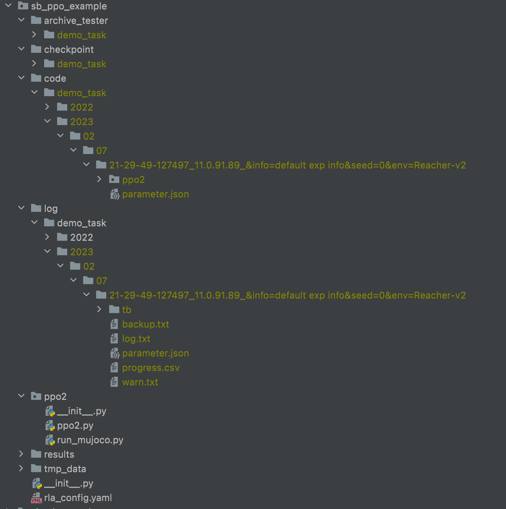

# RL experiment Assistant (RLA)


RLA is a tool for managing your RL experiments automatically (e.g., your hyper-parameters, logs, checkpoints, figures, code, etc.), which is forked from https://github.com/xionghuichen/RLAssistant.
RLA has decoupled from the training code and only some additional configurations are needed. Before using RLA, we recommend you to read the section "Design Principles of RLA", which will be helpful for you to understand the basic logic of the repo. 

[comment]: <> (The logger function of RLA is forked from and compatible with the logger object in [openai/baselines]&#40;https://github.com/openai/baselines&#41;. You can transfer your logging system easily from the "baselines.logger" by modifying the import lines &#40;i.e., ```from baselines import logger``` -> ```from RLA import logger```&#41;.)

**Instead of building a document for each function, we give the best practices of RLA in the following readme file, which summarizes the standard workflow we expect you to manage your experiments and all of the related api. refer to the Workflow section for details.**


## Design Principles of RLA


The core design principle of RLA is regarding all related information of each Experiment As A complex item in a Database (EaaD). 
We design RLA to manage the experiment dataset by 
1. formulating, standardizing, and structuring the data items and tables of the "RL experiment database";
2. provide tools for adding, deleting, modifying, and querying the items in the database.

The following are the detailed designs of EaaD and the implementation of RLA.
### Standardizing and Structuring the Experiment Database
After integrating RLA into your project, we create a "database" implicitly configured by `rla_config.yaml`. 
Each experiment we run will be indexed and stored as an item into a "table". In particular, RLA includes the following elements to construct an "RL experiment database".
1. **Database**: A database is configured by a YAML file `rla_config.yaml`. In our practice, we only create one database for one research subject.
2. **Table**: We map the concept of Table in standard database systems into the concept of "task" in our research process. There are many similarities between the two concepts. For example, we will create another table/task often when:
   1. the structures of tables are different, e.g., they have different keys. In the research process, different tasks often have totally different types of logs to record. For example, in offline model-based RL, the first task might pretrain a dynamics model the second task might be policy learning with the learned model. In model learning, we are concerned with the MSE of the model; In policy learning, we are concerned with the rewards of policy. 
   2. The content of a table is too large which might hurt the speed of querying.  Table partition is a common solution. In the research process, we need large memory to load a Tensorboard if the logdir has many runs. We can solve the problem by splitting the runs into different sub-directories.
   
   In RLA, we need to assign a "task" for each experiment to run.
3. **Data Item**:  We map the concept of the data item to the complex generated data in an experiment. For each data item, we need to define the index and the value for each item.
   1. **Index**: We need a unique index to define the item in a table for item adding, deleting, modifying, and querying. In RLA, we define the index of each experiment as: `datetime of the experiment (for uniqueness) + ip address (for keeping uniqueness in distributed training) + tracked hyper-parameters (easy to identify and easy to search)`.
   2. **Value**: when running an experiment, we generate many data with different structures. Based on our research practice, currently, we formulate the following data for each experiment
      1. Codes and hyper-parameters: Every line of the code and select hyper-parameters to run the experiment. This is a backup for experiment reproducibility.    
      2. Recorded variables: We often record many intermediate variables in the process of the experiment, e.g., the rewards, some losses, or learning rates. We record the variables in the key-value formulation and store them in a tensorboard event and a CSV file.   
      3. Model checkpoints: We support weight saving of neural networks and related custom variables in Tensorflow and Pytorch framework. We can use the checkpoints to resume experiments or use the results of the experiment to complete downstream tasks.
      4. Other data like figures or videos:  We might plot the frame-to-frame video of your agent behavior or some curves to check the process of training. We give some common tools in the RL scenario to generate the related variables and store them in the directory.
      5. Temporary data: For some training paradigms, we might need to store some data to the disks, e.g., large-scale replay buffers, which need to be independently maintained for each experiment. 

Currently, we store the data items in standard file systems and manage the relationships among data items, tables, and databases via a predefined directory structure. 
After running some experiments, the database will be something like this:


Here we construct a database in "example/sb_ppo_example/". We hold different types of the ``Value`` in different folder: 
- The directory "results" is to store other data like figures or videos.
- The directory "log" is to store recorded variables.
- The directory "code" is a backup of the code and hyperparameters for experiment reproducibility.
- The directory "hyperparameter" is also a backup of hyperparameters for briefly checking your experiment.
- The directory "checkpoint" saves the weights of neural networks.
- The directory "tmp_data" is to store other temporary data.
- The directory "archive_tester" is to store hyper-parameters and related variables for experiment resuming [almost deprecated. 

The experiment data are stored in the above folders 
with the same "structured names" based on the formulation of `{$task_table_name}${%Y}/${%m}/${%d}/${%H-%M-%S-%f}_${ip address}_${tracked hyper-parameters}`, 
where ``{$task_table_name}`` is a customized string to explain the purpose of the experiments in this "task table",  which is the root of the experiments (`demo_task` in the figure), 
``${%Y}/${%m}/${%d}/${%H-%M-%S-%f}`` records the timestamp of the created experiment, `${ip address}` records the machine that creates the experiment, and `${tracked hyper-parameters}` are some auto-generated hyper-parameters to explain the features of the experiments.


### Tools to Manage the Database

In standard database systems, the commonly used operations to manage a database are adding, deleting modifying, and querying. We also give similar tools to manage the RLA database.

Adding:
1. RLA.exp_manager is a global object to create experiments and manger the data in the process of experiments.
2. RLA.logger is a module to add recorded variables.
3. RLA.MatplotlibRecorder and RLA.ImgRecorder are modules to construct other data like figures.

Deleting:
1. rla_scripts.delete_exp.py: a tool to delete experiment data by regex;

Modifying:
1. resume: RLA.ExperimentLoader: a class to resume an experiment with different flexible settings. 

Querying:
1. tensorboard: the recorded variables are added to tensorboard events and can be loaded via standard tensorboard tools.
  
2. easy_plot: We give some APIs to load and visualize the data in CSV files. The results will be something like this:
   ```python
    from RLA.easy_plot.plot_func_v2 import plot_func
    data_root='your_project'
    task = 'sac_test'
    regs = [
        '2022/03/01/21-[12]*'
    ]
    _ = plot_func(data_root=data_root, task_table_name=task, 
   regs=regs , split_keys=['info', 'van_sac', 'alpha_max'], metrics=['perf/rewards'])
   ```
    

Backup:
1. rla_scripts.archive_expt.py: a tool to archive experiment data by regex;
2. rla_scripts.migrate_expt.py: a tool to move  experiment data by regex.

### Other principles

The second design principle is easy to integrate.  We give several example projects integrating with RLA in the directory example. 

1. PPO with RLA based on the [stable_baselines (tensorflow)](https://github.com/Stable-Baselines-Team/stable-baselines): example/sb_ppo_example
2. PPO with RL based on the [stable_baselines3 (pytorch)](https://github.com/DLR-RM/stable-baselines3): example/sb3_ppo_example

We also list the RL research projects using RLA as follows:
1. [MAPLE](https://github.com/xionghuichen/MAPLE)
2. [CODAS](https://github.com/xionghuichen/CODAS)

## Installation
```angular2html
git clone https://github.com/polixir/RLAssistant.git
cd RLAssistant
pip install -e .
```


## Workflow


We build an example project to include most of the features of RLA, which can be seen in ./example/simplest_code. Now we summarize the steps to use it.

### Quick Start

#### Step1: Configuration. 
1. To configure the experiment "database", you need to create a YAML file rla_config.yaml. You can use the template provided in ./example/rla_config.yaml as a starting point.
2. Before starting your experiment, you should configure the RLA.exp_manager object. Here's an example:

    ```python
      from RLA import exp_manager
      import os

      kwargs = {'env_id': 'Hopper-v2', 'lr': 1e-3}
      debug = False

      # Set hyperparameters for your experiment
      exp_manager.set_hyper_param(**kwargs)

      # Add parts of hyperparameters to name the index of data items for better readability
      exp_manager.add_record_param(["env_id"])
      
      # To keep the conciseness of your experiment "database", we recommend creating an additional task table for debugging.
      # When debugging a new feature, set the `debug` value to True, then the recorded experiments will be stored in a temporary location (`demo_task_debug` in this example), instead of mixing into your formal experiment "database". 
      if debug:
          task_table_name = 'demo_task_debug' # Define a task for debug
      else:
          task_table_name = 'demo_task_v1' # Define a task for training
      

      def get_package_path():
          return os.path.dirname(os.path.abspath(__file__))

      rla_data_root = get_package_path() # Set the place to store the data items

      rla_config = os.path.join(get_package_path(), 'rla_config.yaml')

      ignore_file_path = os.path.join(get_package_path(), '.gitignore')

      # Configure the exp_manager object with the specified settings
      exp_manager.configure(task_table_name=task_table_name, ignore_file_path=ignore_file_path,
                             rla_config=rla_config, data_root=rla_data_root)

      exp_manager.log_files_gen() # Initialize the data items

      exp_manager.print_args()

   ```
   Note that ignore_file_path is a gitignore-style file used to ignore files when backing up your project into the code folder. It is an optional parameter, and you can use your project's .gitignore file directly.

   After that, the folders to store your experiment data will be created. Your can locate these found via:
   - exp_manager.results_dir for "results"
   - exp_manager.log_dir for "log"
   - exp_manager.code_dir for "code"
   - exp_manager.hyperparameter_dir for "hyperparameter"
   - exp_manager.checkpoint_dir for "checkpoint"
   - exp_manager.tmp_data_dir for "tmp_data"
   - exp_manager.pkl_file for "archive_tester"

4. Add the generated data items to your .gitignore file to avoid pushing them into your Git repository:
   ```gitignore
   **/tmp_data/**
   **/hyperparameter/**
   **/archive_tester/**
   **/checkpoint/**
   **/code/**
   **/results/**
   **/log/**
   **/arc/**
   ```


#### Step2: record intermediate variables/checkpoints/other types of data.

**Record intermediate scalars**

We record scalars by `RLA.logger`: 
```python
# Import the RLA logger to record scalars
from RLA import logger
# Import TensorFlow for creating summary data to log
import tensorflow as tf
# Import the time step holder, holding a global instance that tracks the current time step
from RLA import time_step_holder

# Iterate for 1000 time steps (or any number of time steps/epochs)
for i in range(1000):
    # Update the time step holder with the current time step (iteration/epoch/whatever you need) value.
    # You just need to set the value once when it is changed.
    time_step_holder.set_time(i)
    
    # Set the scalar value to record
    value = 1
    
    # Record the scalar value using the RLA logger, with "k" as the key and the global time step instance in time_step_holder as the step value.
    # This allows you to track the value of the scalar over time (e.g. during training).
    logger.record_tabular("k", value)
    
    # Dump the tabular data to the logger for storage and display.
    # This saves the logged data to disk (or other storage location) and displays it in the console (if desired).
    logger.dump_tabular()


```
**Record checkpoints**

In order to save checkpoints of neural networks in your experiment, you can use the ``exp_manager.save_checkpoint`` method. Here's an example code snippet: 
```python
from RLA import exp_manager
exp_manager.new_saver()

for i in range(1000):
    if i % 10 == 0:
        exp_manager.save_checkpoint()
```
This code creates a new saver object and saves a checkpoint every 10 iterations of the loop.

You can also just use `exp_manager.checkpoint_dir` to locate the checkpoint directory, then customize your saving code. When loading, you can use the following code to locate your experiments
```python
from RLA import single_experiment_query
from RLA.easy_log.const import *

data_root=rla_data_root # refer to the example code in Step1.
loaded_task_table_name = task_table_name # refer to the example code in Step1.
loaded_task_date = '2023/10/03/10-44-05-111111' # the timestamp you run the experiment, with the format of ``${%Y}/${%m}/${%d}/${%H-%M-%S-%f}`` .

query_res = single_experiment_query(data_root, loaded_task_table_name, loaded_task_date, CHECKPOINT)
your_checkpoint_dir = query_res.dirname # it would be the same to the result of exp_manager.checkpoint_dir at the time you run the experiment.

# [your code to load the neural network based on `your_checkpoint_dir`.]
```

**Record other types of data** 

Apart from recording checkpoints, RLA also provides support for recording other types of data. Currently, you can record complex-structured data using tensorboard. Here's an example code snippet:

```python
import tensorflow as tf
from RLA import logger

# Record data from tensorflow summary
summary = tf.Summary()
logger.log_from_tf_summary(summary)

# Record data using tensorboardX writer
kwargs = {'tag': 'aa'}
logger.get_tbx_writer().add_audio(**kwargs)

```

In the future, RLA plans to develop APIs to record commonly-used complex-structured data in ``RLA.easy_log.complex_data_recorder``.

In addition, RLA also provides the ``MatplotlibRecorder`` tool to manage your figures generated by Matplotlib. Here's an example code snippet:


```python
from RLA import MatplotlibRecorder as mpr
def plot_func():
   import matplotlib.pyplot as plt
   plt.plot([1,1,1], [2,2,2])
mpr.pretty_plot_wrapper('func', plot_func, pretty_plot=True, xlabel='x', ylabel='y', title='react test')
```

This code plots a figure using Matplotlib and saves it in the "results" directory.

### Handle your historical experiments. 

The methods to handle the experiments can be split into the following modules:

Currently, we develop the query tools based on two common scenarios: result visualization and experiment review. 


#### Result visualization

1. Tensorboard: We can use tensorboard/tensorboardX to view the recorded logs. The event of tensorboard will be saved in `${data_root}/log/${task_name}/${index_name}/tb/events`. 
      We can view the results in tensorboard by: `tensorboard --logdir ${data_root}/log/${task_name}`.
      For example, lanuch tensorboard by `tensorboard --logdir ./example/simplest_code/log/demo_task/2022/03`. The resulting visualization will look like this: 
2. Easy_plot toolkit: We recommend using Jupyter notebooks to maintain your research projects, where you can record your ideas, surmises, related empirical evidence, and benchmark results together. We provide high-level APIs to load the CSV files of the experiments (stored in `${data_root}/log/${task_name}/${index_name}/progress.csv`) and group the curves by custom keys. We have provided common use cases of the plotter at [test_plot.ipynb](https://github.com/xionghuichen/RLAssistant/blob/main/test/test_plot.ipynb). The resulting visualization will look like this: 
3. View data in "results" directory directly: other types of data are stored in `${data_root}/results/${task_name}/${index_name}` 


#### Experiment code review 

Given any experiment named as `${task_name}/${index_name}`, we can find the line-by-line code in `${data_root}/code/${task_name}/${index_name}` and corresponding hyperparameters in `${data_root}/code/${task_name}/${index_name}/parameter.{json/yaml}`. We can configure the files to be stored in BACKUP_CONFIG in rla_config.yaml.

You can use the `Compare with...` method in Pycharm or any `folder comparison` extension in vscode, e.g., [Compare Folders](https://marketplace.visualstudio.com/items?itemName=moshfeu.compare-folders), to compare the whole differences between any two experiments.


#### Modify: Get any parts of your results for post-process

You can use experiment_data_query and single_experiment_query to load any parts of your results.

```python
from RLA import single_experiment_query, experiment_data_query
from RLA.easy_log.const import LOG, ARCHIVE_TESTER, OTHER_RESULTS, TMP_DATA, HYPARAMETER, CHECKPOINT

data_root=rla_data_root # refer to the example code in Step1.
loaded_task_table_name = task_table_name # refer to the example code in Step1.
loaded_task_date = '2023/10/03/10-44-05-111111' # the timestamp you run the experiment, with the format of ``${%Y}/${%m}/${%d}/${%H-%M-%S-%f}`` .

query_res = single_experiment_query(data_root, loaded_task_table_name, loaded_task_date, CHECKPOINT)
your_checkpoint_dir = query_res.dirname # it would be the same to the result of exp_manager.checkpoint_dir at the time you run the experiment.

# [your code to load the neural network based on `your_checkpoint_dir`.]


query_res = single_experiment_query(data_root, loaded_task_table_name, loaded_task_date, HYPARAMETER)
your_config = query_res.hyper_param

# [your code to post-process based on the HYPARAMETER at the time you run the experiment, e.g., classes initialization.]
# SACAgent(your_config.algorithm.agent)


query_res = single_experiment_query(data_root, loaded_task_table_name, loaded_task_date, TMP_DATA)
your_tmp_data_dir = query_res.dirname

# [your code to post-process based on the TMP_DATA at the time you run the experiment, e.g., load replay buffers.]
# replay_buffer_path = osp.join(your_tmp_data_dir, 'replay_buffer.npz')

```

#### Modify: continue to training or resume for another task

In our practice, a common scenario is to load  historical experiments/modules to resume training or for downstream tasks. In RLA, you can customize the related code based on the following pipeline:

```python
import os.path as osp
from RLA import single_experiment_query, fork_log_file_fn, update_hyper_parameters_fn

# 1: init a new experiment instance, refer to Step1: configuration.

# 2: get the expeirment to load
data_root=rla_data_root # refer to the example code in Step1.
loaded_task_table_name = task_table_name # refer to the example code in Step1.
loaded_task_date = '2023/10/03/10-44-05-111111' # the timestamp you run the experiment, with the format of ``${%Y}/${%m}/${%d}/${%H-%M-%S-%f}`` .

# 3: load the hyperparameters
query_res = single_experiment_query(data_root, loaded_task_table_name, loaded_task_date, HYPARAMETER)
load_config = query_res.hyper_param

if continue_to_train:
   # copy all the hyperparameters and attributes of the exp_maneger in loaded_task_table_name/loaded_task_date to the current exp_maneger object.
   update_hyper_parameters_fn(loaded_task_table_name, loaded_task_date, rla_data_root, hp_to_overwrite=['device', 'info'])
   query_res = single_experiment_query(data_root, loaded_task_table_name, loaded_task_date, HYPARAMETER)
   load_config = query_res.hyper_param

# 4: initialize your agent/trainer.
if continue_to_train:
   your_trainer(load_config)
else:
   merge_config = your_config_merge_fn(load_config, new_config) # your code to merge the to configs.
   your_trainer(merge_config)

query_res = single_experiment_query(data_root, loaded_task_table_name, loaded_task_date, CHECKPOINT)
last_ckp = query_res.all_ckps[-1]
your_checkpoint_loader(os.path.join(query_res.dirname, last_ckp))
# or use exp_manager.load_checkpoint(ckp_index=1111)

# 5: load other data like replay buffer
query_res = single_experiment_query(data_root, loaded_task_table_name, loaded_task_date, TMP_DATA)
replay_buffer_path = osp.join(query_res.dirname, 'replay_buffer.npz')
your_replay_buffer_loader(replay_buffer_path)

if continue_to_train:
   # 6: copy all the log data in the load experiment to the new experiment.
   fork_log_file_fn(loaded_task_table_name, loaded_task_date, rla_data_root, sync_timestep=True)
   start_steps = exp_manager.time_step_holder.get_time()
your_trainer.train()
```


#### **Batch Management**

We manage the items in the database via toolkits in rla_scripts. Currently, the rla_scripts includes
1. Archive: archive important experiments into an archived database, which will be saved in DATA_ROOT/arc.
2. Delete: delete all useless experiments at once.
3. Send to remote [TODO]
4. Download from remote [TODO]

We can use the above tools after copying the rla_scripts to our research project and modifying the DATA_ROOT in config.py to locate the root of the RLA database. We give several user cases in https://github.com/xionghuichen/RLAssistant/blob/main/test/test_scripts.py. 
We will also introduce our practices of using RLA to manage our projects .


## Distributed training & centralized logs

In practice, we might conduct our experiments in multiple physical machines for the same project. 
Different physical machines separate the experiment data in the database. 
We develop a simple log-sending tool based on ftplib/pysftp. 
We split the physical machines into a main node and slave nodes. 
For each slave node, we should extra configure the following setting in `rla_config.yaml`:
```
SEND_LOG_FILE: True
REMOTE_SETTING:
  ftp_server: '114.114.114.114'
  username: 'agent'
  password: '123'
  remote_data_root: 'remote_project/data_root/'
  file_transfer_protocol: 'sftp'
  port: 22
```
where `SEND_LOG_FILE` is set to True,  `ftp_server`, `username` and `password` are the ip address, username and passward of the master node respectively, and `file_transfer_protocol` is the protocol to send data.  `remote_data_root` defines the data_root of the database in the main node. 
For the main node, configure the exp_manger by `exp_manager.configure(..., is_master_node=True)`. 
In our experiment code, we should call the function `RLA.exp_manager.sync_log_file` periodically, for example, 
```
for i in range(1000):
    # your trianing code.
    exp_manager.sync_log_file()
```
then the data items will be sent to the `remote_data_root`  of the main node. Since `is_master_node` is set to True in the main node, the `exp_manager.sync_log_file()` will be skipped in the main node.

PS: 
1. You might meet "socket.error: [Errno 111] Connection refused" problem in this process. The solution can be found [here](https://stackoverflow.com/a/70784201/6055868).

2. An alternative way is to build the NFS for your physical machines and locate data_root to the NFS.

## More demos

We write the usage of RLA as unit tests. You can check the scripts in `test` folder for more details (include test_plot.py, test_scripts.py, and test_proj/proj/test_manger.py).

# TODO
- [ ] support custom data structure saving and loading.
- [ ] support video visualization.
- [ ] add comments and documents to the functions.
- [ ] add an auto-integration script.
- [ ] download/upload experiment logs through timestamp.
- [ ] allow sync LOG only or ALL TYPE LOGS.
- [ ] add unit_test to ckp loader.


## Star History

[](https://star-history.com/#polixir/RLAssistant&Date)

